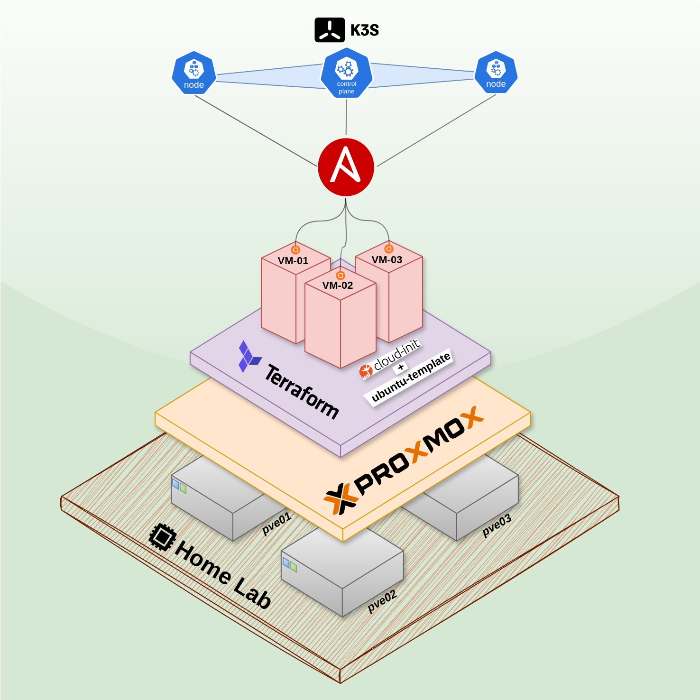

# Proxmox k3s Lab

This repository provisions a reproducible 3-node k3s cluster on Proxmox using Terraform for infrastructure and Ansible for configuration. The control plane runs on `k3s-server-01` and two workers run on `k3s-agent-01` and `k3s-agent-02`.

## Architecture diagram



## Prerequisites

Proxmox:
- Proxmox cluster reachable from your workstation.
- API token with VM creation rights.
- Ubuntu 24.04 cloud-init template that includes the QEMU guest agent and SSH access.
- DHCP available on the VM network (the project uses `ip=dhcp`).

Workstation:
- Terraform 1.6+.
- Ansible 2.15+ (or compatible).
- Python 3 and OpenSSH (`ssh`, `ssh-keygen`).
- The private key that matches the `ssh_public_key` used in Terraform.

Network/Name resolution:
- Either DNS or `/etc/hosts` mapping for the VM hostnames (the deploy script can update `/etc/hosts`).

## Repository Layout

- `terraform/` - Proxmox VM provisioning.
- `ansible/` - Inventory, playbooks, and roles.

## Configuration

1. Copy `terraform/terraform.tfvars.example` to `terraform/terraform.tfvars`.
2. Update these Terraform variables (required):
   - `proxmox_api_url`
   - `proxmox_api_token_id`
   - `proxmox_api_token_secret`
   - `template_name`
   - `ssh_public_key`
3. Optional variables you may want to change:
   - `vm_user` (cloud-init user; if set, the deploy script will pass it to Ansible)
   - `vm_cores`, `vm_memory_mb`, `vm_disk_gb`
   - `vm_storage`, `vm_bridge`
   - `k3s_nodes` (node names, roles, and Proxmox targets)

## Environment variables

These are optional environment variables used by the helper scripts:
- `SSH_PRIVATE_KEY` - Path to the private key matching `ssh_public_key` in Terraform.
- `TFVARS_FILE` - Alternate path to a `terraform.tfvars` file.
- `IP_WAIT_SECONDS` - Total seconds to wait for guest agent IPs (default: 300).
- `IP_WAIT_INTERVAL` - Seconds between IP checks (default: 10).
- `CLEAN_TERRAFORM` - If set to `1`, `destroy.sh` also removes local state and plugin cache.

## Workflow

1. Provision the VMs:

   ```bash
   cd terraform
   terraform init
   terraform apply
   ```

2. Ensure name resolution for the VMs (DNS or `/etc/hosts`). The inventory uses hostnames, not IPs.

3. Configure the cluster:

   ```bash
   cd ansible
   ansible-playbook site.yml
   ```

## One-command deploy

Use the helper script to run Terraform, update `/etc/hosts`, and execute Ansible:

```bash
./deploy.sh
```

Note: it uses `sudo` to update `/etc/hosts` on your local machine.

Optional environment overrides for the deploy script:

```bash
SSH_PRIVATE_KEY=~/.ssh/proxmox \   # Private key that matches ssh_public_key
TFVARS_FILE=terraform/terraform.tfvars \  # Alternate tfvars file
IP_WAIT_SECONDS=600 \             # Increase wait time for guest agent IPs
IP_WAIT_INTERVAL=15 \             # Increase poll interval
./deploy.sh
```

## One-command destroy

Use the helper script to destroy everything and clean local host entries:

```bash
./destroy.sh
```

Optional: remove local Terraform state and plugin cache:

```bash
CLEAN_TERRAFORM=1 ./destroy.sh
```

## Notes

- All VMs are cloned from the same template, use `vmbr0` with DHCP, and store disks on `local-lvm`.
- QEMU guest agent is enabled for all nodes.
- The k3s server kubeconfig is located at `/etc/rancher/k3s/k3s.yaml` on `k3s-server-01`.
